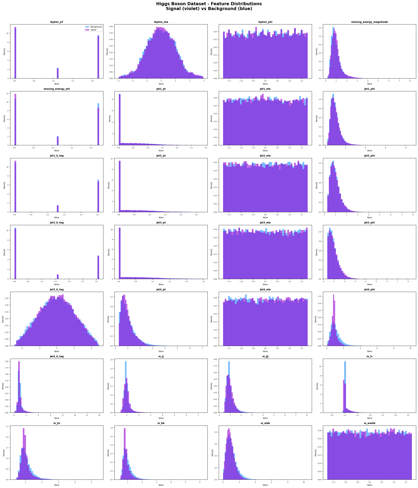
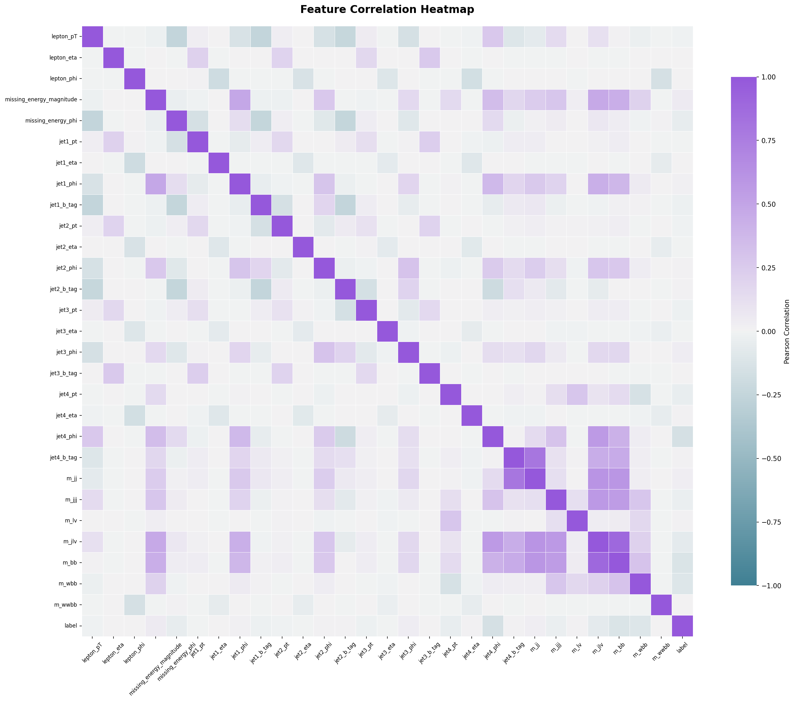
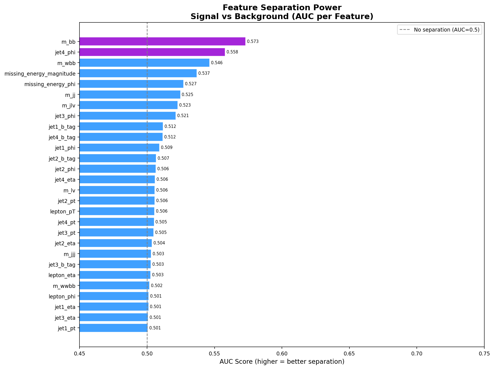
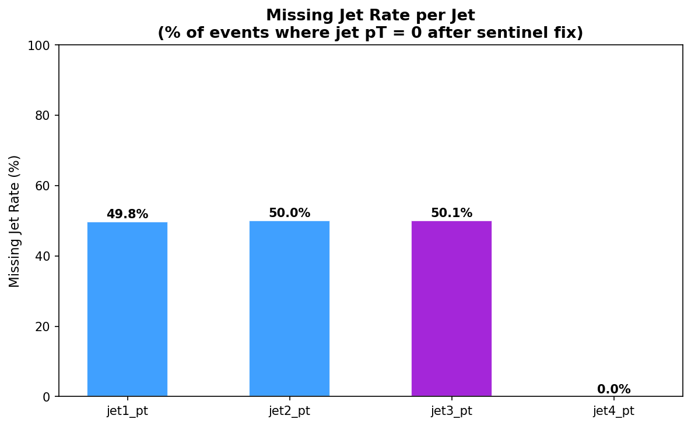
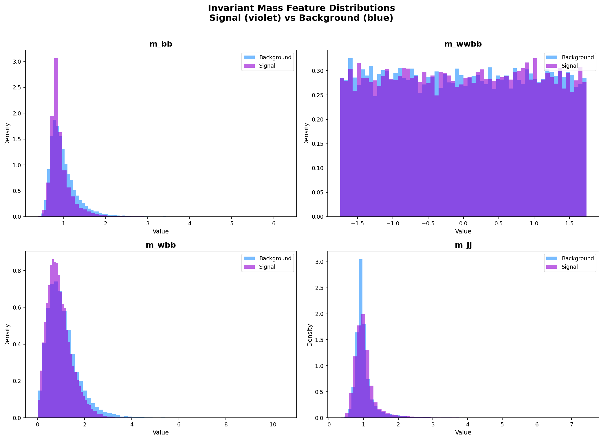

# the large data collider
### a distributed data engineering pipeline for higgs boson detection

by [Khy Almojuela](https://github.com/khy411)

---

## overview

this project builds an end-to-end data engineering pipeline that ingests raw particle collision data from the Higgs Boson dataset, transforms TFRecords into analytics-ready Parquet files, and generates feature distribution reports using PySpark, TensorFlow, and pandas. 

the binary data format was undocumented, and the pipeline had to be reverse-engineered from raw protobuf bytes to extract 28 physics features per collision event.

---

## pipeline architecture
```
TFRecord files (training / validation)
         |
         v
parse TFRecords (reverse-engineered protobuf)
         |
         v
pandas DataFrame (50k sample) / PySpark DataFrame (11M full)
         |
         v
physics-aware cleaning + validation
         |
         v
Parquet storage (columnar, compressed)
         |
         v
analytics report (feature distributions, separation scores)
```

---

## novelty

- **format translation at scale**: Parquet is analytics-native. while general-purpose tools exist, there is no off-the-shelf pipeline purpose-built for physics datasets with domain-aware validation. this project fills that gap.
- **reverse-engineered protobuf structure**: the nested binary format was undocumented. the feature bytes were extracted by decoding raw protobuf wire format manually.
- **physics-aware data validation**: negative pT values are not errors, they are sentinel values meaning no jet was detected. the cleaner handles this as domain knowledge, not a data quality issue.
- **dual-mode execution**: the pipeline runs in pandas mode for sampling and PySpark mode for the full 11M records, same logic, swappable engine.

---

## tech stack

| tool | purpose |
|---|---|
| TensorFlow | TFRecord parsing |
| pandas | tabular transformation (sample mode) |
| PySpark | distributed processing (full mode) |
| PyArrow | Parquet read/write |
| Matplotlib | feature distribution plots |
| Seaborn | correlation heatmap |
| scikit-learn | AUC separation scoring |

---

## setup
```bash
git clone https://github.com/khy411/large-data-collider.git
cd large-data-collider
python -m venv venv
source venv/bin/activate
pip install -r requirements.txt
```

java is required for PySpark:
```bash
sudo apt install -y default-jdk
echo 'export JAVA_HOME=$(dirname $(dirname $(readlink -f $(which java))))' >> ~/.bashrc
source ~/.bashrc
```

---

## dataset

this project uses the Higgs Boson dataset from Kaggle.

1. download from: https://www.kaggle.com/datasets/ryanholbrook/higgs-boson
2. place the `training/` and `validation/` folders in the project root
```
large-data-collider/
|-- training/
|   |-- shard_00.tfrecord
|   |-- ...
|-- validation/
|   |-- shard_00.tfrecord
|   |-- ...
```

---

## how to run

**pandas mode (50k sample):**
```bash
cd src
python writer.py
python analytics.py
```

**PySpark mode (full 11M records):**
```bash
cd src
python spark_pipeline.py
```

---

## analytics

### feature distributions
signal (violet) vs background (blue) across all 28 collision features.



### correlation heatmap
pearson correlation across all 28 features and the label.



### auc separation score
ranks each feature by how well it individually separates higgs signal from background noise.



### missing jet rate
percentage of collision events where each jet was undetected (pT sentinel = 0 after cleaning).



### invariant mass distributions
zoomed distributions of the four mass features, the most physically significant features for higgs detection.



---

## 50k sample dataset summary 

| split | total records | signal | background |
|---|---|---|---|
| training | 50,000 | 26,552 (53.1%) | 23,448 (46.9%) |
| validation | 62,500 | 33,184 (53.1%) | 29,316 (46.9%) |

---

## full pipeline dataset summary 

| split | total records | signal | background |
|---|---|---|---|
| training | 10,500,000 | 5,563,915 (53.0%) | 4,936,085 (47.0%) |
| validation | 500,000 | 265,208 (53.0%) | 234,792 (47.0%) |
| **total** | **11,000,000** | **5,829,123 (53.0%)** | **5,170,877 (47.0%)** |

---

## license

MIT